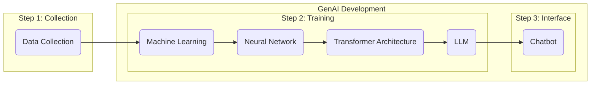

# Introduction

***Key Takeaway:** For copywriters to use AI responsibly, they must know how to use it effectively, efficiently, and ethically.*

## Copywriting In The Age of AI 

GenAI tools are increasingly prevalent across businesses, government institutions, universities, social media, and anywhere content is created for user access. At BYU-Idaho, we are employing GenAI tools in faculty and student workflows, navigating this adaptable technology in ways that enhance human experience rather than detract from it. It hasn't been easy. As GenAI is being examined by my policy writers for regulation and advanced by corporations for profits, our future of Human-AI collaboration is unpredictable.  

We assume that GenAI is here to stay, and that humanity will address and resolve the risks, limitations, and ethical concerns of the technology so that it can increase, not diminish, human dignity and liberty. To play our part, the *AI Copywriting Manual* provides Copywriters the knowledge and strategies they need to use GenAI tools responsibly. Copywriters for BYU-Idaho at University Communications need to understand GenAI tools to use them effectively, efficiently, and ethically.

> ### Consider This
>
> **What is Artificial Intelligence?**
>
> - How do we get from AI to Chatbots?
>
> - What is the process of training a Chatbot?
>
> - How do Chatbots work?
> 
> **What are the possibilities, limitations, and risks of AI Chatbots?**
>
> - *Possibilities:* Human-AI Collaboration, and Accelerated Productivity, Learning, Creativity, Reasoning, Analysis, and Research.
>
> - *Limitations:* Tokens, Context Window, Limited Reasoning, No True Understanding, and Limited Data Access.
>
> - *Risks:* Hallucinations, Sychophancy, Bias, Cognitive Overreliance, Data Privacy, Copyright, Academic Integrity, and Plagiarism.
>
> **How does AI collect your data?**
>
> - How does AI train on your chats?
>
> - What data does AI collect?
>
> - Where does AI collect data?
> 
> **How can you protect your data?**
>
> - CES Privacy Principles
>
> - BYU-Idaho Data Classification
>
> - What Data Can You Use Safely?

### What Is Artificial Intelligence? 
The term AI is widely used, but not all AI tools work the same way. We are concerned with how GenAI generates written content, not code, images, mathematics, videos, or any other form of content. While some of the information about generated text might apply to other forms of generated content, we are assuming that Copywriters will only be writing and editing copy, not any other form of content. Copywriters are encouraged to apply the same judgment to those other forms of generated content as they would to generated text.

When you think of AI, you might think of tools like ChatGPT, Google Gemini, or Microsoft Copilot. However, those tools aren't the extent of AI; they are the product of a multi-step process: data collection and machine learning, model construction and training, and deployment and interface.

###### ***GenAI Step-By-Step***

Textual data, such as web pages, books, repositories, articles, blogs, academic papers, Wikipedia, news archives, and public forums, is collected and processed into individual units called **Tokens**. GenAI models use tokens to calculate the statistical relationships across language and train their models on data in a process called **Machine Learning (ML)**.  

In ML, rather than programming the computer to understand this data, an algorithm analyzes the patterns within the data to learn automatically. Through this process, a system of synthesized data emerges called a **Neural Network**. The synthesized data is used to reverse engineer human-like language. Using multiple neural networks, called the **Transformer Architecture**, the data enters the **Natural Language Processing** stage, where it begins to process tokens and track their connections.  

Once the model completes natural language processing, it becomes a **Large Language Model (LLM)**, a model of human-like language. The LLM can read, reason, and generate text that resembles human text. However, despite its capabilities, it still isn't like the chatbots we are using. Converting an LLM into a **Chatbot** requires an additional training stage. In this final stage, it is trained to become a conversational system that manages the dialogue flow, personalizes responses, and serves as a helpful, adaptable assistant. 

> #### **AI Terminology**
> **Artificial Intelligence (AI):** the computer systems that are trained to perform tasks in ways that resemble human intelligence. 
>
> **Machine Learning (ML):** the process of training AI, without explicitly programming it, with an algorithm developed from patterns found in data sets. 
>
> **Neural Network:** the model created by machine learning that resembles the structure and function of the neural networks found in the brain. 
>
> **Transformer Architecture:** the collection of neural networks that helps build AI models by converting text into tokens. 
>
> **Tokens:** the unit of data processed by AI models during training. In natural language processing, they represent words, parts of a word, or individual characters. 
>
> **Natural Language Processing:** the processing of human-like language for a computer system. This includes the process of finding relationships between words in neural networks and converting them into tokens. 
>
> **Large Language Model (LLM):** the model based on transformer architecture, trained from a large amount of text for natural language processing and language generation. 
>
> **Chatbots:** software applications built on LLMs that are meant to generate text that resembles human-like conversation, reasoning, and creativity. They are specifically trained to provide helpful, responsive assistance for GenAI chatbots.
