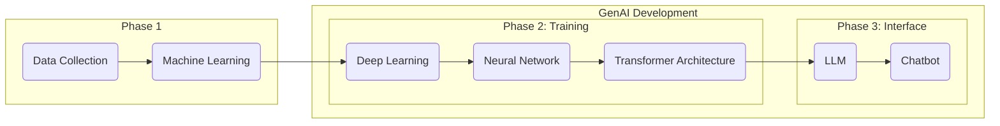

# Copywriting In the Age of AI 
***Key Takeaways:** For Copywriters to use AI responsibly, they must know its possibilities, risks, and limitations to use it effectively, efficiently, and ethically. Its primary roles in copywriting is to Find, Challenge, and Inspect*

**Generative Artificial Intelligence (GenAI)** tools have become prevalent across many creative, tech, and knowledge sectors, promising to automate repetitive tasks and increase productivity.[1](#cite-1) Its scope is increasing day by day, and many industries are rushing to adopt this technology.

BYU-Idaho is navigating the future of Human-AI collaboration, preparing students for the future workforce by employing GenAI tools in faculty and student workflows.[2](#cite-2),[3](#cite-3)

The capacity of GenAI tools makes it easy for people to replace their own effort with machine-generated content, but current research demonstrates that this approach has an overall negative impact on quality and performance across many areas.[4](#cite-4),[5](#cite-5),[6](#cite-6) Yet, there is also evidence that Human-AI collaboration can complement our capabilities, helping us rather than harming or hindering.[7](#cite-7) 

The conflicting data suggests there is an appropriate middle ground for GenAI, but finding that middleground is easier said than done. Using the current models requires an apprehensive—*both comprehensive and skeptical*—approach. The apprehensive approach assumes that GenAI tools are going to stay relevant in the future, and that humanity will address and resolve the issues with GenAI, but in the meantime individuals and organizations must define specific policies and guardrails to protect against overreliance of AI.

> **Consider This**
>
> **What is Artificial Intelligence?**
>
> - How do we get from AI to Chatbots?
> - What is the process of training a Chatbot?
> - How do Chatbots work?
> 
> **What are the possibilities, limitations, and risks of AI Chatbots?**
>
> - *Possibilities:* Human-AI Collaboration, Accelerated Productivity, Learning, Creativity, Reasoning, Analysis, and Research.
> - *Limitations:* Tokens, Context Window, Limited Reasoning, No True Understanding, and Limited Data Access.
> - *Risks:* Hallucinations, Sycophancy, Bias, Cognitive Overreliance, Data Privacy, Copyright, Academic Integrity, and Plagiarism.

## Can Artificial Intelligence Keep Its Promises?
There is a group of enthusiastic developers and fans of GenAI that promise this technology will promote political and economic health, and a better future for all. Furthermore, they claim individuals will one day have access to a 24/7 AI agent that will enable individuals to enhance personal relationships, career advancement, education, creativity, and fulfillment by enabling them to perform almost any task from their computers.[8](#cite-8) 

AI enthusiasts promise what GenAI might be, but those promises do not describe what GenAI currently is. Copywriters in particular are promised that GenAI will augment and automate their tasks, leading to increased productivity and decreased mental drudgery. Some AI enthusiasts believe that Copywriters, and other similar roles, are going to be completely replaced by GenAI. Nevertheless, as it stands, GenAI models have limitations and risks that prevent them from completely replacing the work and effort of Copywriters.

GenAI enthusiasts may argue that the limitations and risks of AI do not demonstrate that Copywriters cannot be replaced, only that GenAI requires human oversight to govern and verify outputs. The need for human oversight means that GenAI is not prepared to fulfill the enthusiasts' promises. Potentially, AI could be incorporated into a Copywriter's workflow to increase productivity, but that is not equivalent to the Copywriter role itself.

The purpose of *The AI Copywriting Manual* is to provide Copywriters for BYU-Idaho at University Communications the knowledge and strategies they need to responsibly use GenAI tools effectively, efficiently, and ethically. This section provides an introduction to GenAI, exploring its proposed capabilities weighed against its limitations and risks, its development and training processes, and its appropriate use cases for Copywriters.

***
“A computer can never be held accountable, therefore a computer must never make a management decision.”
***
*
– IBM Training Manual, 1979
*

## What Is Artificial Intelligence? 
**Artificial Intelligence (AI)** is a popular term that refers to diverse technologies with different functions and purposes. It is generally described as technology that is meant to simulate human-like intelligence. GenAI is a modern adaptation of AI technologies meant to generate human-like creations such as text, code, images, math, videos, or any other form of content.[9](#cite-9) 

While much of the information presented here about AI development, training, and generated content might apply to other forms of content,[10](#cite-10) this manual focus on primarily on the tasks related to copywriting that can be replicated by GenAI, such as:

- **Research**
- **Planning and outlining**
- **Brainstorming and drafting**
- **Editing grammar, tone, and style**
- **Logical Analysis**
- **Review and quality control**
- **Citation and reference generation**
- **Content Creation**

Copywriters might feel intimidated by GenAI tools' capacity to generate vast amounts of text and feel that they will have to use them to keep up and stay relevant. However, Copywriters should be aware of GenAIs underlying mechanics, specifically how AI models are developed and trained. The development process exposes key insights about the roles that AI can play in copywriting. 

GenAI is a product of a multi-step process, it wasn't created by a team of programmers meticulously coding every single prompt and output one-by-one. AI engineers built GenAI through a three-phase process: (1) collecting large amounts of text and training machines to read it, (2) constructing a language processing model and training it to respond, and (3) preparing the model to become an adaptable and helpful assistant.

### ***Phase 1***

AI models are trained in a process called **Machine Learning**, a branch of AI that performs data analysis tasks, using mathematics and statistics to understand text.[11](#cite-11) By using a large amount of data, Machine Learning can start to guess relationships and recognize patterns between things without explicit programming.[12](#cite-12)

This textual data is gathered from across the internet, including: web pages, books, repositories, articles, blogs, academic papers, Wikipedia, news archives, public forums, and more.[13](#cite-13)

The collection of textual data also introduces a few risks:
- The collection and training process itself is expensive. It requires large data centers which have negative impacts on the environments around them.[14](#cite-14)
- There are ethical and legal concerns with data collection that include intellectual property rights and data privacy violations.[15](#cite-15) 
- Textual data is made-up of contradicting contexts, styles, and types of text.[16](#cite-16)
- Models will unintentionally learn bias, misinformation, and confidential information from textual data.[17](#cite-17)
- GenAI tools were trained on mixed datasets with contradictory textual data (e.g. reddit forums), and with such high volumes of textual data there is no guarantee that it is perfectly error-free, even when cleaned.[19](#cite-19)

Some of these risks are mitigated by a preprocessing step where data scientists clean the data by filtering out bad data, and setting a specific standard for the machine to learn,[18](#cite-18) but it cannot resolve these issues completely. 

Machine learning can understand textual data by converting text into individual units called **Tokens** (roughly ¾ of a word, including punctuation and formatting). Machine Learning uses the numerical ids assigned to each work to start building a statistical model of language. For example:

*Humans read:*

    The quick brown fox jumps over the lazy dog.

*AI reads:* 

    ["The", " quick", " brown", " fox", " jumps", " over", " the", " lazy", " dog", "."]
    [976, 4853, 19705, 68347, 65613, 1072, 290, 29082, 6446, 30]

For more complicated words, Tokenization breaks them down into smaller parts:

*Humans read:*

    Supercalifragilisticexpialidocious.

*AI reads:*

    ["Super", " cal", " if", " rag", " il", " istic", " exp", " ial", " id", " ocious", "."]
    [17789, 5842, 366, 17764, 311, 6207, 8067, 563, 315, 170661, 13]

Its like learning math to understand English: the idea is that these AI models will be able to take the text, "I like to pet" and it will predict the next word based on the context. For instance, it might think there is a 50% chance the next word is dog.

AI is probabilistic not deterministic, meaning that it doesn't ever understand the meaning of the word, it just finds the next word based off of chance. This introduces one of AI's greatest limitations: **Hallucinations:** the generation of entirely fabricated text that sounds plausible and authoritative. It is important for Copywriters to understand that hallucinations are a feature, not a bug. Everything that AI generates is based on how it calculates tokens, but it doesn't recall, remember, research, or verify its outputs.

Some AI models, like Google Gemini, have access to search and retrieval systems, which increases its range of context and decreases the amount of guesswork that it does. However, Gemini does not understand the concept of "don't believe everything you read on the internet", so fact-checking is still necessary. There is also no guarantee that it properly understood the source it was pulling from.

Hallucinations are one of the most important reasons why Copywriters are still necessary, because you have the ability to verify information that GenAI can't. You can govern words and syntax where GenAI can only make estimations. This limitation begins with Machine Learning, but as AI models become more advanced, hallucination only becomes more apparent, not less.

### ***Phase 2***

**Deep Learning** is a more advanced version of Machine learning. It emerges when the statistical relationships created in Machine Learning are designed to have a network that resembles neural patterns found in the brain. This process is extremely complicated, but what emerges is a system called a **Neural Network**, which can start to process complex tasks that require pattern analysis, logical reasoning, and structured outputs.[20](#cite-20)

Deep Learning allows machines to train themselves as they are able to run both a training session and a checking session at the same time. By utilizing the large dataset developed earlier the machine can train to recognize all the patterns found within and then check its own work. As the machines are trained, the neural networks grow.[21](#cite-21)

Once the neural network is developed it is paired with multiple other neural networks to create **Transformer Architecture**, allowing the new model to perform multiple complex tasks simultaneously and begin **Natural Language Processing**. Then the model is able to use the neural networks built to understand language to now create responses to textual inputs, allowing seamless Human-AI communication.

Hallucinations are enhanced by transformer architecture because the information being processes has so much more neural networks to pass through. Errors will cascade as each layer will have its own hallucination.[22](#cite-22)

### ***Phase 3***

**Large Language Models** are the result of Transformer Architecture that has been trained for Natural Language Processing. Once an LLM model has been created it is essentially a blank slate, but still maintains access to the vast training data.[23](#cite-23)

Converting an LLM into a **Chatbot** requires an additional training stage called **Fine-Tuning**. In this final stage, it is trained to become a conversational system that manages the dialogue flow, personalized responses, and serves as a helpful, adaptable assistant using two strategies: **Reinforcement Learning from Human Feedback (RLHF)** and **Direct Preference Optimization (DPO)**:[24](#cite-24)

* **RLHF** is a form of fine-tuning where humans rank different outputs to the same prompt. The goal is to train the LLM with a reward model to tailor its responses to reflect like the highest ranked prompt and less like the lowest ranked prompt. This fine-tuning strategy is meant to align outputs to be more accurate, helpful, and safe, but these are more like guidelines for the model, not hard-coded limits.[25](#cite-25)
* **DPO** is a newer version of RLHF where the preferences are not found in a separate model, but included directly into the model itself. The model trains itself to produce the kinds of responses people want to see based on the internal token mechanisms. However, this can have unintended consequences because human overview is significantly decreased.

Both of these fine-tuning methods feed into two specific tendencies of hallucination: **Sycophancy** and **Overconfidence**:

* **Sycophancy** is the tendency for GenAI to reinforce opinions with flattery, praise, and subservience.[26](#cite-26) Since the human trainers tended to reward when LLMs confirmed their prior convictions and beliefs, the LLMs were trained to prioritize user experience rather than truth verification.
* **Overconfidence** is the tendency for GenAI to prefer its own generated text rather than human written text.[27](#cite-27) Since LLMs generate text that are "mathematically sound" according to its internal statistical mechanics, generated text is more likely to align with what calculates as good writing. This is a type of GenAI confirmation bias.

While parameters are put in place to help, these behaviors can only be mitigated, but because they are emergent features, and unless the fundamental structure is changes these problems will never go away. Therefore, Copywriters using GenAI to write will undermine their own abilities becasuse GenAI will take the their text, adjust it to align with its own preferences, and confidently present it as an improved draft, while praising the original text and ideas at the same time. Since GenAI is outputting hallucinations it cannot actually verify that its improved draft is objectively better, but it might convince the Copywriter anyways.

Another emergent feature is that prolonged use tends to make GenAI outputs worse overtime called **The Context Window**, which is the finite space that AI models have to process information; it represents the information available to an AI model at a given time. The tokens that GenAI processes takes up space, so it can only calculate a certain amount of tokens at a time. Moreover, each token carries statistical weight, so the more information it has to process the more it will struggle to produce helpful or even relevant responses.

Think of it like a conversation between you and a friend, you don't need to remember every time your friend says the word "the", because you understand the semantic meaning of the conversation. You don't have to break each word down and create a statistical representation in your mind, but if your friend was talking to AI instead of you, then it would need to make those calculations because it doesn't understand what your friend is saying. GenAI can't listen, even if it says it can, because it doesn't know what words really matter. Deep Learning and Natural Language Processing are their to convince the user that the AI is human-like. 

Despite the flaws, after the LLM has been trained to interact with users, it is deployed as a GenAI Chatbot interface. These tools inherent all of the possibilities, limitations, and risks that have been discussed so far. This completes the process of developing GenAI tools.

### ***GenAI Step-By-Step***

## Using Artificial Intelligence
GenAI chatbots like ChatGPT, Google Gemini, or Microsoft Copilot are tools that BYU-Idaho Copywriters will have access to through their official `@byui.edu` accounts. Using GenAI tools effectively requires a significant time investment that challenges the supposed productivity GenAI is promised to give users. Consider these two scenarios:

* **Scenario One**: A Copywriter is writing content for a websites landing page. They want to make sure that the output is stylistic, helpful, readable, and factual. So the Copywriter spends time tailoring a prompt with a specific persona and the necessary context such as the style guide, the goal of the website, and the format. They try out a few different prompts, adjusting each time for an improved output, while also managing the limitations of the context window and making sure the responses aren't factually incorrect. After the Copywriter created the perfect prompt, they edit the output, making their own adjustments, ensuring it sounds human-like. By the time they are finished the Copywriter wonders is this was an efficient and effective use of GenAI because of the time and effort required for oversight. 

* **Scenario Two:** A Copywriter is writing a blog. They produce a quick prompt asking GenAI to write a blog about the subject without providing information or context. They get three to five different blogs. Then they ask GenAI to find the best version of the blog. Once selected, they ask AI to edit and revise for one final version. After the Copywriter submitted the blog they realized that they took about 30 minutes to complete a task that would take at least several hours on their own. However they didn't check themselves for hallucination, misinformation, and poor-quality copy, potentially submitting something with very low quality. Still, it does at least guarantee the appearance of productivity.

Copywriters likely fall somewhere in between the two scenarios, but these demonstrate a general reality about using these tools: GenAI tools are only as effective and efficient as the Copywriter using them. 

* The first Copywriter embraced GenAI as a helpful assistant that they had to lead to success, but undermined their own ability to actually write the content themselves, and instead tailored a machines output. 

* The second Copywriter embraced GenAI as a content generator that requires only someone to prompt, but no one to overview. 

Yet, the approach was the same, they believed that GenAI should perform the majority of the tasks in their role, with the only difference being the level of overview they provided. Yes, GenAI has the ability to write all of the text for Copywriters, but *human governance is in every word*, not just in prompting the machine. No, it is not about using AI to complete every task, but finding which tasks GenAI can complete without compromising human integrity, and remaining efficient, effective, and ethical.

*The AI Copywriting Manual* encourages Copywriters to take responsibility for their tasks, adopting the apprehensive approach where GenAI is used in specific roles with high overview. The roles this manual proposes are: ***Find, Challenge, and Inspect.***

### ***Find***
GenAI's hallucinations prevent it from becoming a truly effective researching, summarizing, and note-taking tool. There is never a guarantee that it has generated an accurate response, even if its reasoning and syntax appear authoritative. Copywriters should not leverage GenAI as a replacement for traditional research methods and tools, but by taking advantage of the integrated search systems, they can efficiently augment the search for relevant sources.  

By using GenAI as a search tool for research materials you are able to quickly find sources that relate directly at a greater rate. It will still be up to you to verify the appropriateness, accuracy, and authority of each source. Tools like Google's Gemini, which are connected to systems like Google Search and Google Scholar, could easily be introduced into the Copywriter's research strategy.

* ***Example:*** A Copywriter is researching for a website but wants to find sources faster. He uses Google Gemini's connections to Google Search to find reliable by sources by using it as an advanced search engine. Instead of breaking down his question into topics and keywords, the GenAI is able to use its Natural Language Processing to breakdown the sentence and find webpages that address similar subjects.

Find more effective strategies and tools for Find here:

### ***Challenge***
Copywriters can assign GenAI tools user personas to test stress points and friction within their copy. It can offer various perspectives to challenge the Copywriter's assumptions, offering a fast-paced review with various audiences. While not a total replacement, during the drafting and revising period, this feature can be used to sharpen thinking, especially when used with skepticism.

The principle behind Challenge is using GenAI to sharpen the Copywriters work by evaluating underlying assumptions, casual connections, logical thinking, and rhetorical strategy. GenAI shouldn't suggest methods to overcome these gaps, but it may help the Copywriter see an issue they weren't aware of. The goal with Challenge is to use GenAI as a tool that strengthens Copy through rigorous testing, not automatic rewriting. By assigning testing and analytical personas the Copywriter will be able to better reason through, defend, and explain decisions that they made.

* ***Example:*** A Copywriter isn't sure about the blog they are writing so they give AI a role, asking it to play the part of the audience they are writing for. The Copywriter asks it to look for potential areas where the information is incomplete or confusing. The Copywriter then compares the evaluation to the text and decides what changes they can make and what they should keep.

Find more effective strategies and tools for Challenge here:

### ***Inspect***
GenAI is able to process large amounts of text almost instantaneously. Through that process, they are able to analyze, evaluate, and critique texts' weaknesses and strengths. The issue is that even with context and prompt engineering, GenAI will still make erroneous mistakes. GenAI should not be used as the only editing tool and tone, style, and grammar should always be reviewed by humans, but it can quickly evaluate large amounts of text to evaluate large-scale patterns and structure.

GenAI should be given specific parameters before evaluating text, such as persona, style guidelines, and objectives. When going through the final audit, the Copywriter can evaluate the AI-reviews one at a time and still use their own judgment to determine what is best.

* ***Example:*** The Copywriter just finished editing a page, but wants one last quick overview just in case there was something that he missed. They ask the AI to evaluate the text for any mistakes, but not to edit or change anything. The AI finds one sentence that repeats the word the, which they accidentally skimmed over. The Copywriter reads over the page one last time with the AI reviews in mind and finds all the easy-to-miss errors.

Find more effective strategies and tools for Inspect here:

## Citations

1.  https://www.goldmansachs.com/insights/articles/how-will-ai-affect-the-us-labor-market [↩ Back to text](#ref-1)
2.  https://www.byui.edu/ai/academics [↩ Back to text](#ref-2)
3.  https://www.unesco.org/en/artificial-intelligence/recommendation-ethics [↩ Back to text](#ref-3)
4.  https://www.mdpi.com/2075-4698/15/1/6 [↩ Back to text](#ref-4)
5.  https://news.harvard.edu/gazette/story/2025/11/is-ai-dulling-our-minds/ [↩ Back to text](#ref-5)
6.  https://tulanehullabaloo.com/74464/data/ai-reliance-may-have-detrimental-cognitive-effects-new-study-finds/ [↩ Back to text](#ref-6)
7.  https://mitsloan.mit.edu/press/new-mit-sloan-research-suggests-ai-more-likely-to-complement-not-replace-human-workers [↩ Back to text](#ref-7)
8.  https://about.fb.com/news/2026/08/the-future-is-for-everyone/ [↩ Back to text](#ref-8)
9.  https://www.ibm.com/think/topics/artificial-intelligence [↩ Back to text](#ref-9)
10.  https://sloanreview.mit.edu/article/how-genai-changes-creative-work/ [↩ Back to text](#ref-10)
11.  https://platform.openai.com/tokenizer [↩ Back to text](#ref-11)
12.  https://aws.amazon.com/what-is/machine-learning/ [↩ Back to text](#ref-12)
13.  https://help.openai.com/en/articles/7842364-how-chatgpt-and-our-foundation-models-are-developed [↩ Back to text](#ref-13)
14.  https://blog.ansi.org/ansi/ai-data-centers-carbon-water-energy-impact/ [↩ Back to text](#ref-14)
15.  https://iapp.org/news/a/generative-ai-and-intellectual-property-the-evolving-copyright-landscape [↩ Back to text](#ref-15)
16.  https://tan-hexiang.github.io/Blinded_by_Generated_Contexts/ [↩ Back to text](#ref-16)
17.  https://miamioh.edu/howe-center/hwac/resources-for-teaching-writing/assessing-bias-in-large-language-models.html [↩ Back to text](#ref-17)
18.  https://www.mayhemcode.com/2025/12/how-google-uses-reddit-comments-to.html [↩ Back to text](#ref-18)
19.  https://lakefs.io/blog/data-preprocessing-in-machine-learning/ [↩ Back to text](#ref-19)
20.  https://aws.amazon.com/what-is/neural-network/ [↩ Back to text](#ref-20)
21.  https://www.dataversity.net/articles/from-neural-networks-to-transformers-the-evolution-of-machine-learning/ [↩ Back to text](#ref-21)
22.  https://arxiv.org/html/2510.04933v1 [↩ Back to text](#ref-22)
23.  https://www.ibm.com/think/topics/large-language-models [↩ Back to text](#ref-23)
24.  https://www.ibm.com/think/topics/rlhf [↩ Back to text](#ref-24)
25.  https://www.superannotate.com/blog/direct-preference-optimization-dpo [↩ Back to text](#ref-25)
26.  https://arxiv.org/pdf/2310.13548 [↩ Back to text](#ref-26)
27.  https://arxiv.org/html/2509.24988v1 [↩ Back to text](#ref-27)

