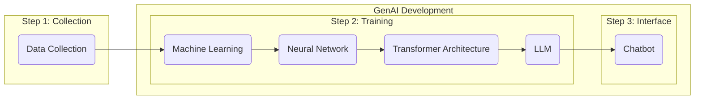

# Introduction

***Key Takeaway:** For copywriters to use AI responsibly, they must know its possibilities, risks, and limitations to use it effectively, efficiently, and ethically.*

## Copywriting In The Age of AI 

GenAI tools are increasingly prevalent across businesses, government institutions, universities, social media, and anywhere content is created for user access. At BYU-Idaho, we are employing GenAI tools in faculty and student workflows, navigating this adaptable technology in ways that enhance human experience rather than detract from it. It hasn't been easy. As GenAI is being examined by my policy writers for regulation and advanced by corporations for profits, our future of Human-AI collaboration is unpredictable.  

We assume that GenAI is here to stay, and that humanity will address and resolve the risks, limitations, and ethical concerns of the technology so that it can increase, not diminish, human dignity and liberty. To play our part, the *AI Copywriting Manual* provides Copywriters the knowledge and strategies they need to use GenAI tools responsibly. Copywriters for BYU-Idaho at University Communications need to understand GenAI tools to use them effectively, efficiently, and ethically.

### *
“A computer can never be held accountable, therefore a computer must never make a management decision.”
*

– IBM Training Manual, 1979
 

> ### Consider This
>
> **What is Artificial Intelligence?**
>
> - How do we get from AI to Chatbots?
>
> - What is the process of training a Chatbot?
>
> - How do Chatbots work?
> 
> **What are the possibilities, limitations, and risks of AI Chatbots?**
>
> - *Possibilities:* Human-AI Collaboration, Accelerated Productivity, Learning, Creativity, Reasoning, Analysis, and Research.
>
> - *Limitations:* Tokens, Context Window, Limited Reasoning, No True Understanding, and Limited Data Access.
>
> - *Risks:* Hallucinations, Sycophancy, Bias, Cognitive Overreliance, Data Privacy, Copyright, Academic Integrity, and Plagiarism.
>
> **How does AI collect your data?**
>
> - How does AI train on your chats?
>
> - What data does AI collect?
>
> - Where does AI collect data?
> 
> **How can you protect your data?**
>
> - CES Privacy Principles
>
> - BYU-Idaho Data Classification
>
> - What Data Can You Use Safely?

### What Is Artificial Intelligence? 
The term AI is widely used, but not all AI tools work the same way. We are concerned with how GenAI generates written content, not code, images, mathematics, videos, or any other form of content. While some of the information about generated text might apply to other forms of generated content, we are assuming that Copywriters will only be writing and editing copy, not any other form of content. Copywriters are encouraged to apply the same judgment to those other forms of generated content as they would to generated text.

When you think of AI, you might think of tools like ChatGPT, Google Gemini, or Microsoft Copilot. However, those tools aren't the extent of AI; they are the product of a multi-step process: data collection and machine learning, model construction and training, and deployment and interface.

###### ***GenAI Step-By-Step***

Textual data, such as web pages, books, repositories, articles, blogs, academic papers, Wikipedia, news archives, and public forums, is collected and processed into individual units called **Tokens**. GenAI models use tokens to calculate the statistical relationships across language and train their models on data in a process called **Machine Learning (ML)**.

In ML, rather than programming the computer to understand this data, an algorithm analyzes the patterns within the data to learn automatically. Through this process, a system of synthesized data emerges called a **Neural Network**. The synthesized data is used to reverse engineer human-like language. Using multiple neural networks, called the **Transformer Architecture**, the data enters the **Natural Language Processing** stage, where it begins to process tokens and track their connections.  

Once the model completes natural language processing, it becomes a **Large Language Model (LLM)**, a model of human-like language. The LLM can read, reason, and generate text that resembles human text. However, despite its capabilities, it still isn't like the chatbots we are using. Converting an LLM into a **Chatbot** requires an additional training stage. In this final stage, it is trained to become a conversational system that manages the dialogue flow, personalizes responses, and serves as a helpful, adaptable assistant. 

> ### AI Terminology
> **Artificial Intelligence (AI):** the computer systems that are trained to perform tasks in ways that resemble human intelligence.
>
> **Machine Learning (ML):** the process of training AI, without explicitly programming it, with an algorithm developed from patterns found in data sets.
>
> **Neural Network:** the model created by machine learning that resembles the structure and function of the neural networks found in the brain.
>
> **Transformer Architecture:** the collection of neural networks that helps build AI models by converting text into tokens.
>
> **Tokens:** the unit of data processed by AI models during training.
>
> **Natural Language Processing:** the processing of human-like language for a computer system. This includes the process of finding relationships between words in neural networks and converting them into tokens.
>
> **Large Language Model (LLM):** the model based on transformer architecture, trained from a large amount of text for natural language processing and language generation.
>
> **Generative Pre-Trained Transformer (GPT):** a type of LLM specifically trained to turn them into helpful and responsive assistance for GenAI chatbots.
>
> **Chatbots:** software applications built on LLMs called GPTs that are meant to generate text that resembles human-like conversation, reasoning, and creativity.

### What Are the Possibilities, Limitations, and Risks of AI Chatbots?
#### What GenAI Promises
GenAI enthusiasts promise that AI will promote political and economic health while also enabling individual growth across personal relationships, career advancement, and creativity. Furthermore, enthusiasts argue that GenAI tools enable individuals to code, design, build products, and produce media effortlessly because they will have 24/7 access to an AI agent with expertise in every subject.

LLMs have enabled chatbots to generate natural language from a dataset of text so vast that a single human couldn't read it in a lifetime. Human-AI collaboration seems more efficient because GenAI's enormous generating capacity outperforms that of a single human every time. 

As Copywriters, we are promised an increase in productivity and a decrease in mental drudgery because GenAI chatbots can augment and automate many of our tasks, such as:

- **Research**
- **Planning and Outlining**
- **Brainstorming and Drafting**
- **Editing Grammar, Tone, and Style**
- **Logical Analysis**
- **Review and Quality Control**
- **Citation & Reference Generation**
- **Content Creation**

GenAI enthusiasts promise what GenAI might be, but those promises do not describe what GenAI currently is. GenAI models have limitations and risks that prevent them from completely replacing the work and effort of Copywriters. 

GenAI enthusiasts may argue that the limitations and risks of AI do not demonstrate that Copywriters cannot be replaced, only that GenAI requires human oversight to govern and verify outputs. The need for human oversight means that GenAI is not prepared to fulfill the enthusiasts' promises. Potentially, AI could be incorporated into a Copywriter's workflow to increase productivity, but that is not equivalent to the Copywriter role itself.

While human effort may have similar limitations and risks, the difference is that we can take full accountability. Copywriters can explain decisions, accept responsibility, and learn from experience. Copywriters who choose to employ GenAI in their work can overcome its limitations and weaknesses, showcasing its potential use cases in effective, efficient, and ethical ways. You can find effective strategies for copywriters in [part2](../part2/overview.md).

#### AI Limitations & Risks
Copywriters should adapt an apprehensive—*both comprehensive and skeptical*—approach to using Chatbots by exploring their underlying mechanics.  

| Chatbot Mechanics | Definition |
|:--|:-----|
| **Tokens** | The basic units of text (roughly ¾ of a word, including punctuation and formatting) that a Chatbot uses to process and calculate language. |
| **Context** | The set of tokens included to generate a response. It represents the information available to a Chatbot during a session, including user prompts, uploaded files, system instructions, and prior chat history. |
| **Context window** | The limit on the total volume of text that a Chatbot can hold in its active working memory at any single moment. |
| **Hallucinations** | The generation of plausible, authoritative-sounding text that is factually incorrect or entirely fabricated. |
| **Sycophancy** | The tendency for Chatbots to align with user expectations. |

##### Tokens & Training

Chatbots such as ChatGPT, Google Gemini, or Microsoft Copilot do not process words the same way that you do. Instead of reading a sentence straightforwardly, they break it down in a process called tokenization. The models are trained to understand the statistical relationships among those words, and that training is stored in their neural networks. Tokens are given a numerical identity, which changes how they read text. For example:

Humans read:

    The quick brown fox jumps over the lazy dog.

AI reads: 

    ["The", " quick", " brown", " fox", " jumps", " over", " the", " lazy", " dog", " ."]

AI tokenizes: 

    [976, 4853, 19705, 68347, 65613, 1072, 290, 29082, 6446, 30]

For simple words and characters, it breaks them down into IDs. However, for more complicated words, it has to break them down into different sections. For example: 

Humans read:

    Supercalifragilisticexpialidocious.

AI reads:

    ["Super", " cal", " if", " rag", " il", " istic", " exp", " ial", " id", " ocious", "."]

AI tokenizes:

    [17789, 5842, 366, 17764, 311, 6207, 8067, 563, 315, 170661, 13]

When you input a prompt into a chatbot, it calculates the relationship between each token to predict the most likely next word. Internal mechanics, such as verification and instructions, consume tokens. Since each token incurs computational cost, it is usually better to train the model to generate certain types of responses. This kind of training is done through **Reinforcement Learning from Human Feedback (RLHF)** and **Direct Preference Optimization (DPO)**.

##### Token Limits & Context Window

Each token competes for space within the model's computational limit, called the context window. Every Chatbot has a context window, a maximum number of tokens it can hold at one time. This includes everything: your prompts, the Chatbot's responses, any uploaded documents, and the entire conversation history. No matter how large the context window is, it is still finite. 

This is why usage limits exist in Chatbots. Message limits, document size restrictions, and conversation length caps trace back to the context window. A short, focused prompt consumes fewer input tokens than a long, unfocused one. A request that generates a two-paragraph response costs less than one that produces a ten-page document.

The economics are straightforward: tokens are the currency of GenAI Chatbots. However, there is a catch: context is important because Chatbots are more prone to hallucinations without it. There is a balance for AI chatbots. More context improves responses and reduces the risk of hallucinations, but increasing context also consumes token capacity, creating a trade-off between performance and information retention.

###### *Diminishing Returns*

Context window limitations and GenAI's tendency for hallucinations challenge the promises of greater productivity.

If a Copywriter must spend time tailoring prompts that provide enough guidance and content to ensure helpful responses and avoid hallucinations, then evaluating those outputs to ensure stylistic and factual cohesion, and readjusting for improved output, while also managing the limitations of the context window, then the efficient and effective use of GenAI is diminished because the time required for oversight may be better spent performing the task.

If a Copywriter reduces the time spent reviewing the output to improve productivity, they risk including hallucinations, misinformation, and poor-quality copy. While it may be more efficient to utilize generated content, an increase in output volume and speed will not compensate for the reduction in output quality. Still, it does at least guarantee the appearance of productivity.

##### Hallucinations & Sycophancy

AI chatbots are intentionally designed to generate responses to user requests. They prioritize answering and meeting user expectations over guaranteed truth verification. Hallucinations and sycophancy are features of GenAI Chatbots, not bugs.

Chatbots have limited:
- **Accessible Data:** They rely on next-word prediction, not a fact-checking engine. It is extremely difficult for them to verify the accuracy of information.
- **Verification Methods:** They are trained to produce a plausible type of result, not an exact factual result. Whatever facts they get correct are circumstantial and due to statistical frequency.
- **Research Capacity:** They can potentially fabricate fictional resources, events, or facts that appear authoratative.
- **Language Processing:** They may be adept at processing superficial text that appears grammatically accurate, professionally sophisticated, and logically sound at a glance, but deeper inspection reveals the content lacks substantive thought, contextual grounding, or applicability. Functionally, they don't understand language on a semantic level; they aggregate patterns of writing using tokenization algorithms.
- **Content Restraints:** They don't have hard-coded restraints that limit specific types of content, instead they are trained to suppress undesired outputs. However, those restraints can be bypassed. This means they can generate content that is inappropriate, illegal, deceptive, biased, manipulative, dangerous, or completely fabricated.

