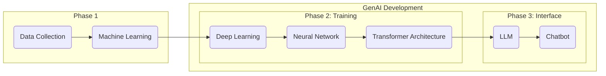

# Copywriting In the Age of AI 
***Key Takeaways:** For copywriters to use AI responsibly, they must know its possibilities, risks, and limitations to use it effectively, efficiently, and ethically.*

Generative Artificial Intelligence tools have become prevalent across many creative, tech, and knowledge sectors, promising to automate repetitive tasks and increase productivity.[1](#cite-1) 

BYU-Idaho is preparing students for the future workforce by employing GenAI tools in faculty and student workflows[2](#cite-2), but it isn't easy because navigating the future of Human-AI collaboration requires both understanding and applying Gen AI tools to serve humanity, not to harm or hinder it.[3](#cite-3)

The capacity of multimodal AI tools makes it easy for people to replace their own effort with machine-generated content, but current research demonstrates that this approach has an overall net negative impact on quality and performance across many areas.[4](#cite-4),[5](#cite-5),[6](#cite-6) Yet, there is also evidence that Human-AI collaboration can complement our capabilities, giving to us rather than taking away from us.[7](#cite-7) 

The conflicting data suggests there is an appropriate middle ground for GenAI, but the current AI models require an apprehensive—*both comprehensive and skeptical*—approach. The apprehensive approach assumes that GenAI tools are going to stay relevant in the future, and that humanity will address and resolve the issues with GenAI, but in the meantime individuals and organizations must define specific policies and guardrails to protect against overreliance of AI.

The purpose of *The AI Copywriting Manual* is to provide Copywriters for BYU-Idaho at University Communications the knowledge and strategies they need to responsibly use GenAI tools effectively, efficiently, and ethically. This section provides an introduction to GenAI, exploring its proposed capabilities weighed against its limitations and risks, its development and training processes, and its appropriate potential use cases for Copywriters.

> **Consider This**
>
> **What is Artificial Intelligence?**
>
> - How do we get from AI to Chatbots?
> - What is the process of training a Chatbot?
> - How do Chatbots work?
> 
> **What are the possibilities, limitations, and risks of AI Chatbots?**
>
> - *Possibilities:* Human-AI Collaboration, Accelerated Productivity, Learning, Creativity, Reasoning, Analysis, and Research.
> - *Limitations:* Tokens, Context Window, Limited Reasoning, No True Understanding, and Limited Data Access.
> - *Risks:* Hallucinations, Sycophancy, Bias, Cognitive Overreliance, Data Privacy, Copyright, Academic Integrity, and Plagiarism.
>
> **Where does AI get data and how can I protect mine?**
>
> - How does AI collect data?
> - What data can you share safely?
> - CES Privacy Principles

## Can Artificial Intelligence Keep Its Promises?
There is a selection of enthusiasts Artificial Intelligence developers and fans that promise this technology will promote political and economic health, and a better future for all. Furthermore, they claim individuals will have access to a 24/7 AI agent that will enable individuals to grow personal relationships, career advancement, education, creativity, and fulfillment by enabling them to perform almost any task from their computers.[8](#cite-8) 

While these promises might either sound exciting or terrifying, the promises from these AI enthusiasts do not represent the reality of current AI technology. AI enthusiasts promise what GenAI might be, but those promises do not describe what GenAI currently is. As Copywriters, we are promised an increase in productivity and a decrease in mental drudgery because GenAI chatbots can augment and automate many of our tasks. Some believe that Copywriters and other similar roles will be completely replaced, but as it stands, GenAI models have limitations and risks that prevent them from completely replacing the work and effort of Copywriters.

***
“A computer can never be held accountable, therefore a computer must never make a management decision.”
***
*
– IBM Training Manual, 1979
*

Copywriters can explain decisions, accept responsibility, and learn from experience. Copywriters who choose to employ GenAI in their work can overcome its limitations and weaknesses, showcasing its potential use cases in effective, efficient, and ethical ways.

## What Is Artificial Intelligence? 
**Artificial Intelligence (AI)** is a popular term that refers to diverse technologies with different functions and purposes. It is generally described as technology that is meant to simulate human-like intelligence. Generative Artificial Intelligence (GenAI) is a modern adaptation of AI technologies meant to generate human-like creations such as text, code, images, math, videos, or any other form of content.[9](#cite-9)

GenAI enthusiasts may argue that the limitations and risks of AI do not demonstrate that Copywriters cannot be replaced, only that GenAI requires human oversight to govern and verify outputs. The need for human oversight means that GenAI is not prepared to fulfill the enthusiasts' promises. Potentially, AI could be incorporated into a Copywriter's workflow to increase productivity, but that is not equivalent to the Copywriter role itself.

GenAI's ability to generate text is the primary concern for roles like that of Copywriters. While much of the information about AI generated text might apply to other forms of content, Copywriters will focus on primarily on the tasks related to Copywriting that can be replicated by AI.[10](#cite-10) These tasks can be summarized as:

- **Research**
- **Planning and outlining**
- **Brainstorming and drafting**
- **Editing grammar, tone, and style**
- **Logical Analysis**
- **Review and quality control**
- **Citation and reference generation**
- **Content Creation**

GenAI tools now have a capacity to generate large volumes of text almost instantaneously. Copywriters might feel intimidated by these tools and feel that they will have to use them to keep up and stay relevant. However, GenAI isn't the extent of AI, it is a product of a multi-step process that creates high-quantity, not high-quality outputs. Understanding the mechanics of this process undermines the apparent capacity of GenAI, highlighting its limitations, and the risks of overreliance.

GenAI wasn't created by a team of programmers meticulously coding every single prompt and output one-by-one. AI engineers built GenAI through a three-phase process: (1) collecting large amounts of text and training machines to read it, (2) constructing a language processing model and training it to respond, and (3) preparing the model to become an adaptable and helpful assistant.

***GenAI Step-By-Step***

### ***Phase 1***

AI models are trained in a process called **Machine Learning**, a branch of AI that performs data analysis tasks, using mathematics and statistics to understand text. By giving using a large amount of data, Machine Learning can start to guess relationships and recognize patterns between things without explicit programming. Machine learning can understand textual data by converting text into individual units called **Tokens** (roughly ¾ of a word, including punctuation and formatting). Each token is assigned a numerical id which the AI can use to start finding patterns. For example:[11](#cite-11) 

*Humans read:*

    The quick brown fox jumps over the lazy dog.

*AI reads:* 

    ["The", " quick", " brown", " fox", " jumps", " over", " the", " lazy", " dog", "."]
    [976, 4853, 19705, 68347, 65613, 1072, 290, 29082, 6446, 30]

For more complicated words, Tokenization breaks them down into smaller parts:

*Humans read:*

    Supercalifragilisticexpialidocious.

*AI reads:*

    ["Super", " cal", " if", " rag", " il", " istic", " exp", " ial", " id", " ocious", "."]
    [17789, 5842, 366, 17764, 311, 6207, 8067, 563, 315, 170661, 13]

Machine Learning treats language as statistics, which essential for building advanced models later. The idea is that when you type the input the sentence, "I like to pet" Machine Learning tells the model that "there is a 50% chance the next word is dogs."

Machine Learning uses the numerical ids assigned to each work to start building a statistical model of language. Its like learning math to understand English: the idea is that these AI models will be able to take the text, "I like to pet" and it will predict the next word based on the context, for instance it might think there is a 50% chance the next word is dog. One of the takeaways for Copywriters is that AI is probabilistic not deterministic, meaning that it doesn't ever understand the meaning of the word, it just finds the next word based off of chance.[12](#cite-12) 

For Machine Learning to be effective it needs to have a vast amount of data, but for GenAI to generate appropriate responses to put that data to use it needs to have context. The more context AI has the less it has to guess, making useful outputs more likely. This textual data is gathered from across the internet, including: web pages, books, repositories, articles, blogs, academic papers, Wikipedia, news archives, public forums, and more.[13](#cite-13) 

However, Machine Learning is one of the root causes for one of AI's greatest limitations: **Hallucinations:** the generation of entirely fabricated text that sounds plausible and authoritative. *It is important for Copywriters to understand that AI hallucinations are a feature, not a bug.* Everything Artificial Intelligence generates is because of probabilities, sometimes it happens to be right. As AI models develop into the other phases hallucinations will only become more integrated into the system.

The collection of textual data also introduces other risks:
- The collection and training process itself is expensive, requiring large data centers that have negative impacts on the environments around them.[14](#cite-14)
- There are ethical and legal concerns with data collection that include intellectual property rights and data privacy violations.[15](#cite-15) 
- Textual data is made-up of contradicting contexts, styles, and types of text.[16](#cite-16)
- Models will unintentionally learn bias, misinformation, and confidential information from textual data.[17](#cite-17)

Some of these risks are negated by a preprocessing step where data scientists clean the data by filtering out bad day, and setting a specific standard for the machine to learn. [18](#cite-18) However, many GenAI tools, such as Google Gemini, were trained on mixed datasets with contradictive textual data (e.g. reddit forums), and with such high volumes of textual data there is no guarantee that it is perfectly error-free.[19](#cite-19)

Once the Machine Learning model has been completely trained on the textual data, it is time to start really developing GenAI.

### ***Phase 2***

**Deep Learning** is a more advanced version of Machine learning, that emerges when the statistical relationships created in phase one are re-engineered to have a multiple-layered network that resembles neural patterns found in the brain. This process is extremely complicated, but what emerges is a system called a **Neural Network**, which can start to process complex tasks that require pattern analysis, logical reasoning, and structured outputs.[20](#cite-20)

Deep Learning allows machines to train themselves as they are able to run both a training session and a checking session at the same time. By utilizing the large dataset developed earlier the machine can train to recognize all the patterns found within and then check its own work. As the machines are trained, the neural networks grow as well. With only limited hands-on human assistance, the machine learns without programming.[21](#cite-21)

Once the neural network is developed it is paired with multiple other neural networks to create **Transformer Architecture**, allowing the new model to perform multiple complex tasks simultaneously and begin **Natural Language Processing**. The AI model is able to use the neural networks built to understand language to now create responses to textual inputs, allowing seamless human-AI communication.

> **Remember:** Multimodal AI models use Transformer Architecture for all forms of communication and digital media. Hence, why GenAI can respond to a picture with no text and even describe it.

Because AI models will always be processing tokens the outputs are still probabilistic. Hallucination is enhanced by transformer architecture because the information being processes has so much more neural networks to pass through. While it might appear that AI may knows basic facts, it is simply because of the frequency that fact has appeared within the data. 

Moreover, some AI models, like Google Gemini, have access to search and retrieval systems, which increases its range of context and decreases the amount of guesswork that it does. However, Gemini does not understand the concept of "don't believe everything you read on the internet", so fact-checking is still necessary. 

*Tokens are the currency of GenAI.* In an AI model's context window, each token competes for space. The context window is a set of tokens included to generate a response; it represents the information available to an AI model including user prompts, uploaded files, system instructions, and textual data. The more tokens you use the more AI has to decide which context it needs to keep for a response or drop. Hallucinations become enhanced because the generative process is bogged down by every single word or phrase. 

> **Remember:** Each word comes with statistical weight, which pulls the model's natural language processing in different directions. Since it is trained to prioritize a natural and helpful response over factual verification, it will start to hallucinate at a more extreme rate when there is more textual data. The mechanics for turning textual data into words are still probabilistic even it is more advanced.

### ***Phase 3***

> ### Notes For Phase 3
> Explain how Transformer Architecture and Natural Language Processing will develop into an LLM. Then explain how LLMs lead to GenAI chatbots. End with the last section of risks and limitations and fully develop the argument as to why AI tools don't live up to the hype. After this focus on the three roles that AI can fulfil for Copywriters.

Once the model completes natural language processing, it becomes a **Large Language Model (LLM)**, a model of human-like language. The LLM can read, reason, and generate text that resembles human text. However, despite its capabilities, it still isn't like the chatbots we are using. 

Converting an LLM into a **Chatbot** requires an additional training stage. In this final stage, it is trained to become a conversational system that manages the dialogue flow, personalizes responses, and serves as a helpful, adaptable assistant.

This kind of training is done through **Reinforcement Learning from Human Feedback (RLHF)** and **Direct Preference Optimization (DPO)**.

#### Tokens & Training
When you input a prompt into a chatbot, it calculates the relationship between each token to predict the most likely next word. Internal mechanics, such as verification and instructions, consume tokens. Since each token incurs computational cost, it is usually better to train the model to generate certain types of responses. 

##### *Diminishing Returns*

* If a Copywriter must spend time tailoring prompts that provide enough guidance and content to ensure helpful responses and avoid hallucinations, then evaluating those outputs to ensure stylistic and factual cohesion, and readjusting for improved output, while also managing the limitations of the context window, then the efficient and effective use of GenAI is diminished because the time required for oversight may be better spent performing the task.

* If a Copywriter reduces the time spent reviewing the output to improve productivity, they risk including hallucinations, misinformation, and poor-quality copy. While it may be more efficient to utilize generated content, an increase in output volume and speed will not compensate for the reduction in output quality. Still, it does at least guarantee the appearance of productivity.

### AI Possibilities
GenAI multimodal chatbots like ChatGPT, Google Gemini, or Microsoft Copilot are tools that BYU-Idaho Copywriters will have access to through their official `@byui.edu` accounts.

When the promises of GenAI are tested against the limitations and risks these models currently have, they are only as effective and efficient as the Copywriter using them. A Copywriter who embraces the technology without preparing to handle the limitations may create copy with errors that were easily preventable with human overview. A Copywriter who uses the technology with cation and strategy fight is not as fast as the first copywriter, but they are more likely to create error-free, helpful copy.

GenAI has the ability to write all of your work for you, but human governance is in every sentence and word, not just prompting the machine. Copywriters should use GenAI with skepticism, reserving GenAI to three specific roles: Find, Challenge, and Inspect.

#### ***Find***
GenAI's hallucinations prevent it from becoming a truly effective researching, summarizing, and notetaking tool. There is never a guarantee that it has sufficiently generated an accurate response, even if its reasoning and syntax appear authoritative. Copywriters should not leverage GenAI as a replacement for traditional research methods and tools, but by taking advantage of the integrated LLMs and search systems, they can efficiently augment the search for relevant sources.  

By using GenAI as a search tool for research materials you are able to quickly find sources that relate directly at a greater rate. It will still be up to you to verify appropriateness, accuracy, and authority of each source. Tools like Google's Gemini, which are connected to systems like Google Search and Google Scholar, could easily be introduced into the Copywriter's research strategy.

You can find more effective strategies for Find here:

#### ***Challenge***
Copywriters can assign GenAI tools user personas to test stress points and friction within their copy. It can offer various perspectives to challenge the Copywriter's assumptions, offering a fast-paced review with various audiences. While not a total replacement, during the drafting and revising period, this feature can be used to sharpen thinking, especially when used with skepticism.

The principle behind Challenge is using GenAI to sharpen the Copywriters work rather than replace it, by evaluating underlying assumptions, casual connections, logical thinking, and rhetorical strategy. GenAI shouldn't suggest methods to overcome these gaps, but it may help the Copywriter see an issue they weren't aware of.

The goal with Challenge is to use GenAI as a tool that strengthens Copy through rigorous testing, not automatic rewriting. By assigning testing and analytical personas the Copywriter will be able to better reason through, defend, and explain decisions that they made.

You can find more effective strategies for Challenge here:

#### ***Inspect***
GenAI is able to process large amounts of text almost instantaneously. Through that process, they are able to analyze, evaluate, and critique texts' weaknesses and strengths. The issue is that even with context and prompt engineering, GenAI will still make erroneous mistakes. GenAI should not be used as the only editing tool. Tone, style, and grammar should always be reviewed by humans.

GenAI should be given specific parameters before evaluating text, such as persona, style guidelines, and objectives. When going through the final audit, the Copywriter can evaluate the AI-reviews one at a time and still use their own judgment to determine what is best.

You can find more effective strategies for Inspect here:

While human effort may have similar limitations and risks, the difference is that we can take full accountability. Copywriters can explain decisions, accept responsibility, and learn from experience. Copywriters who choose to employ GenAI in their work can overcome its limitations and weaknesses, showcasing its potential use cases in effective, efficient, and ethical ways. You can find effective strategies for copywriters in [part2](../part2/overview.md).

# AI Terminology
> * **Artificial Intelligence (AI):** the computer systems that are trained to perform tasks in ways that resemble human intelligence.
> * **Machine Learning (ML):** the process of training AI, without explicitly programming it, with an algorithm developed from patterns found in data sets.
> * **Deep Learning:** a form of machine learning that uses artificial neural networks to mimic the human brain
> * **Neural Network:** the model created by machine learning that resembles the structure and function of the neural networks found in the brain.
> * **Transformer Architecture:** the collection of neural networks that helps build AI models by converting text into tokens.
> * **Tokens:** the unit of data processed by AI models during training.
> * **Tokenization:** the process of converting text into tokens.
> * **Natural Language Processing:** the processing of human-like language for a computer system. This includes the process of finding relationships between words in neural networks.
> * **Large Language Model (LLM):** the model based on transformer architecture, trained from a large amount of text for natural language processing and language generation.
> * **Chatbots:** software applications built on LLMs called GPTs that are meant to generate text that resembles human-like conversation, reasoning, and creativity.

# Citations

1.  https://www.goldmansachs.com/insights/articles/how-will-ai-affect-the-us-labor-market [↩ Back to text](#ref-1)
2.  https://www.byui.edu/ai/academics [↩ Back to text](#ref-2)
3.  https://www.unesco.org/en/artificial-intelligence/recommendation-ethics [↩ Back to text](#ref-3)
4.  https://www.mdpi.com/2075-4698/15/1/6 [↩ Back to text](#ref-4)
5.  https://news.harvard.edu/gazette/story/2025/11/is-ai-dulling-our-minds/ [↩ Back to text](#ref-5)
6.  https://tulanehullabaloo.com/74464/data/ai-reliance-may-have-detrimental-cognitive-effects-new-study-finds/ [↩ Back to text](#ref-6)
7.  https://mitsloan.mit.edu/press/new-mit-sloan-research-suggests-ai-more-likely-to-complement-not-replace-human-workers [↩ Back to text](#ref-7)
8.  https://about.fb.com/news/2026/08/the-future-is-for-everyone/ ↩ Back to text](#ref-8)
9.  https://www.ibm.com/think/topics/artificial-intelligence [↩ Back to text](#ref-9)
10.  https://sloanreview.mit.edu/article/how-genai-changes-creative-work/ [↩ Back to text](#ref-10)
11.  https://platform.openai.com/tokenizer [↩ Back to text](#ref-11)
12.  https://aws.amazon.com/what-is/machine-learning/ [↩ Back to text](#ref-12)
13.  https://help.openai.com/en/articles/7842364-how-chatgpt-and-our-foundation-models-are-developed [↩ Back to text](#ref-13)
14.  https://blog.ansi.org/ansi/ai-data-centers-carbon-water-energy-impact/ [↩ Back to text](#ref-14)
15.  https://iapp.org/news/a/generative-ai-and-intellectual-property-the-evolving-copyright-landscape [↩ Back to text](#ref-15)
16.  https://tan-hexiang.github.io/Blinded_by_Generated_Contexts/ [↩ Back to text](#ref-16)
17.  https://miamioh.edu/howe-center/hwac/resources-for-teaching-writing/assessing-bias-in-large-language-models.html [↩ Back to text](#ref-17)
18.  https://lakefs.io/blog/data-preprocessing-in-machine-learning/ [↩ Back to text](#ref-18)
19.  https://www.mayhemcode.com/2025/12/how-google-uses-reddit-comments-to.html [↩ Back to text](#ref-19)
20.  https://aws.amazon.com/what-is/neural-network/ [↩ Back to text](#ref-20)
21.  https://www.dataversity.net/articles/from-neural-networks-to-transformers-the-evolution-of-machine-learning/ [↩ Back to text](#ref-21)

